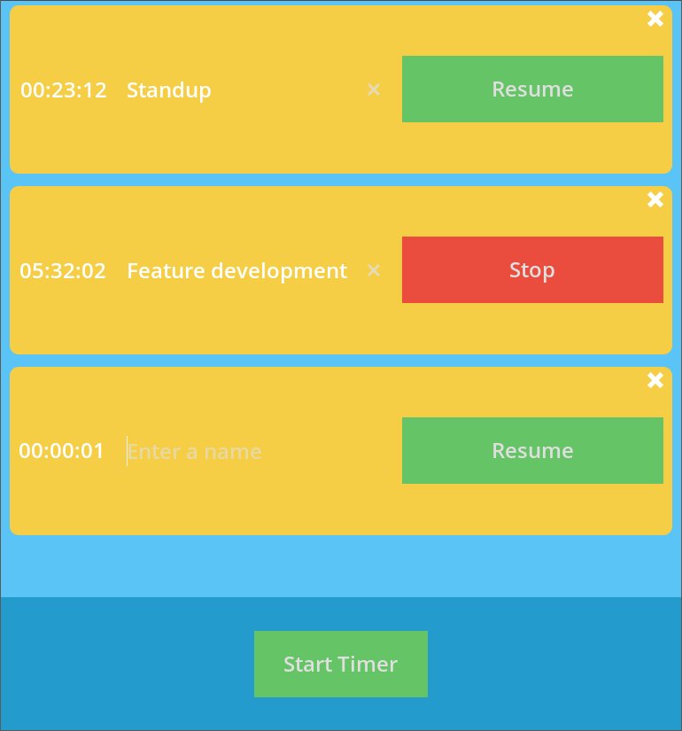

# timely

timely is a small app to help track time, by creating timers on the fly and controlling when they run. Only one timer runs at a time, helping the user track overall use in hh:mm:ss.

## Why?

I found this handy for booking time on issues in source control, for example. There are other tools available, such as Clockify (<https://clockify.me/>) but require an API key or don't really track time outside of an issue. So this was a quick prototype to aid my workflow.

## How?

1. Download the zip.
2. Extract it somewhere.
    1. linux/macos users should make it executable: `chmod u+x timely.x86_64`
4. Run the application.
    1. some users might want to run in compatible mode: `./timely.x86_64 --rendering-driver opengl3`

Hit 'Start Timer' to create a timer, which begins running immediately. A timer can be stopped by hitting the stop button and then resumed by pressing the resume button.

Timers can be deleted by hitting the 'X' and choosing the appropriate option.

Timers can optionally be _named_ by entering a name in place of the placeholder text.

The latest (develop) version can always be found [here](https://jasonmichaeladams.com/timely/).

## TODO

- UI theming. The UI was designed quickly in Freeform and (almost!) mirrors the design exactly.
- Limited to ten timers.
- No persistence.
- An appropriate application framework; this was written in godot.
